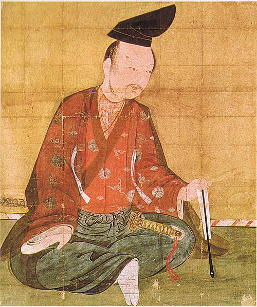
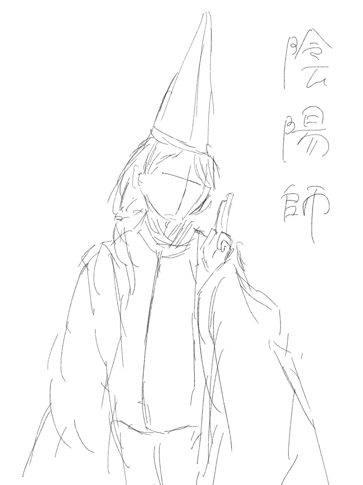

# 平安時代
 
# 1.源平合戦

## 一ノ谷の戦い『鵯越えの逆落とし』(バンジージャンプ)

源義経は僅か70騎を率いて、平氏の一ノ谷陣営を目指す。鵯越で、源義経は「鹿はこの難路を越えるか？」と猟師に問うと、「餌を求め往復する」と答えた。源義経は、「鹿が超えられるならば馬も超えられるであろう」と進んで行く。そして、平氏の一ノ谷陣営の裏手、断崖絶壁の上に辿り着いた。平氏が山側を全く警戒していないことを好機と読んだ源義経は坂を下ることを決断した。馬2頭を先に走らせ、1頭は足を挫いたが、もう1頭は無事に駆け下りる。それを見た源義経は、「皆の者、駆け下りよ！」と先陣を切った。そして、鎌倉政権は平氏に勝利する。これが有名な一ノ谷の戦いでの義経の奇策、「義経の鵯越の逆落とし」だ。
 
## 壇ノ浦の戦い(スプラッシュマウンテン的なの)

先の一ノ谷で敗北を喫した平氏は山口県下関市に逃げた。鎌倉政権は頼朝の弟範頼に3万騎を率いさせて山陽道を進軍して九州に渡り平氏軍の背後を遮断する作戦を実行する。だが、範頼軍は兵糧の不足と優勢な水軍を有する平氏軍の抵抗によって軍を進められなくなった。関門海峡は潮の流れの変化が激しく、水軍の運用に長けた平氏軍はこれを熟知しており、早い潮の流れに乗ってさんざんに矢を射かけて、海戦に慣れない坂東武者の義経軍を押した。勢いに乗った平氏軍は義経を討ち取ろうと攻めかかる。ここで不利を悟った義経が敵船の水手、梶取（漕ぎ手）を射るよう命じ、この時代の海戦では非戦闘員の水手・梶取を射ることは戦の作法に反する行為だったが、義経はあえてその掟破りを行った。やがて、潮の流れが変わって反転すると、義経軍はこれに乗じて平氏軍に猛攻撃を仕掛けた。平氏軍は壊滅状態になり、勝敗は決した。敗北を悟った平氏一門は次々と海上へ身を投じた。これが源平合戦の結末だ。
 
 
# 2.陰陽師(vrアトラクション)

陰陽師は、古代日本の律令制下において中務省の陰陽寮に属した官職の1つで、陰陽五行思想に基づいた陰陽道によって占筮及び地相などを職掌とする方技として配置された者を指すが、それら官人が後には本来の律令規定を超えて占術など方術や、祭祀を司るようになったために陰陽寮に属する者全てを指すようになり、更には中世以降の民間において個人的に占術等を行う非官人の者をも指すようになり、声聞師と重ねられることもあって「声聞師」と呼ばれる場合もあった。中・近世においては民間で私的祈祷や占術を行う者を称し、中には神職の一種のように見られる者も存在する。この際、魔法使いといった認識で良いだろう。
 
 
# 3.平等院鳳凰堂

平等院（びょうどういん）は、京都府宇治市にある藤原氏ゆかりの寺院。 
平安時代後期・11世紀の建築、仏像、絵画、庭園等を今日に伝え、「古都京都の文化財」として世界遺産に登録されている。 
山号を朝日山と称する。宗派は17世紀以来天台宗と浄土宗を兼ね、現在は特定の宗派に属さない単立の仏教寺院となっている。 
本尊は阿弥陀如来、開基は藤原頼通、開山は明尊である。 
以下は、本アトラクションで行えることだ。 
## レストラン プロジェクションマッピング
